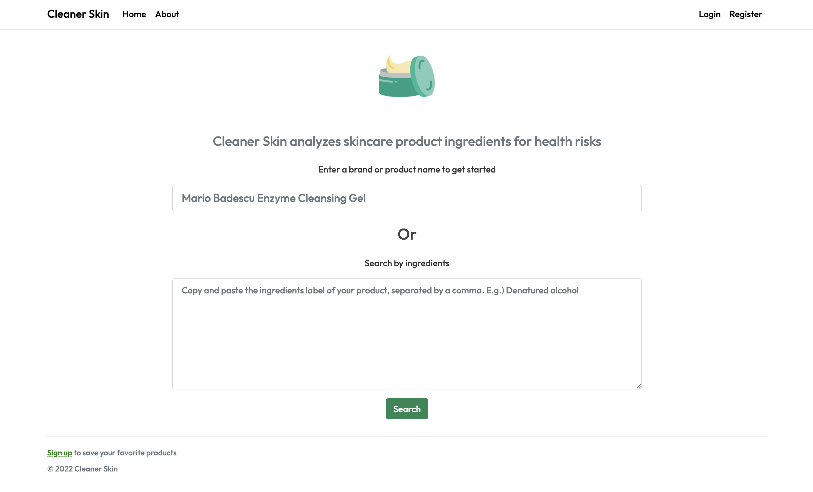
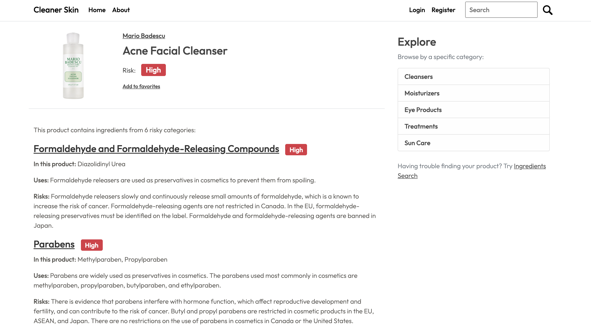

# Cleaner_Skin
https://www.cleanerskin.io

## About Cleaner Skin

Cleaner Skin is a quick and easy tool that analyzes the contents of skincare products for ingredients that may have potentially harmful effects. This tool was created to help consumers become more aware about the ingredients in their everyday skincare products.

As an avid consumer of beauty products, I always found the ingredients labels of skincare products to be confusing to understand. These products are often marketed as natural, sulfate-free, paraben-free, and fragrance-free, but I wanted to know if there were ingredients present that weren't being advertised, but rather hidden in the ingredients labels. I found that there wasn't a standalone tool that could be used to analyze a list of ingredients and clearly show whether it contained any potential health risks.

Website Features:
* Risk ratings, ingredients, and information about risky ingredients for thousands of products 
* Search for a product or by ingredients to assess potential health risks
* Register and log in to save products to favorites
* View all products by a specific brand or category (i.e. Cleaner, Moisturizer, Sun Care, etc)

# Screenshots

Homepage where you can search by product name or by ingredients by copying and pasting the ingredients list of your product:

  <kbd>
    
  </kbd>

About page explains the thresholds used to determine the risk levels of certain ingredients:

  <kbd>
    
  </kbd>

Product page - shows whether there are any health risks in a specific product:

  <kbd>
    
  </kbd>

Ingredients page - shows the results of an ingredients label search for a drugstore body lotion:

  <kbd>
    
  </kbd>

Users with an account can also save products to their Favorites page for later:

  <kbd>
    
  </kbd>

# Technical

Design:
* Model-view-controller design
* RESTful server side architecture

Frontend:
* HTML with Jinja2
* CSS with Bootstrap

Backend:
* PostgreSQL with SQLAlchemy
* Python
* Flask

Deployment:
* Heroku

#### Thanks for checking out my project!